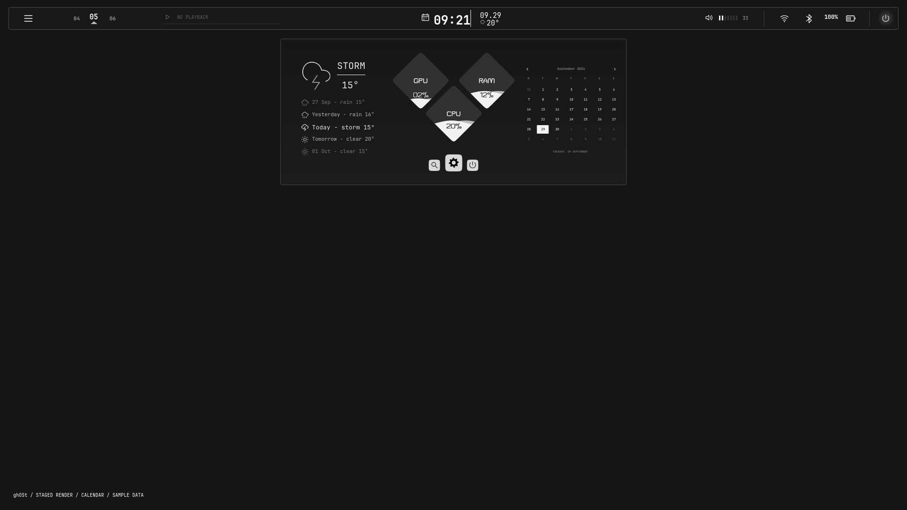

# ghOSt

Graphical Hyprland Operating System Toolkit.

[Preview](https://dsksnkz.github.io/ghOSt/) · [SVG icons](https://dsksnkz.github.io/ghOSt/icons.html) · [Progress](docs/PROGRESS.md)

60 standalone transparent SVG icons, each in black and white. [Usage and rebuilding](docs/icons.md).



## Current scope

Top rail, application launcher, calendar with liquid GPU/RAM/CPU instrumentation, staged left sidebar, audio, network, Bluetooth, media, battery and a confirmation-based power panel. JetBrains Mono typography, a separate monochrome SVG icon pack and click-triggered motion.

The launcher searches installed desktop entries by name, generic name and keywords. Pins are saved in `$XDG_STATE_HOME/ghost/launcher.ini` (default `~/.local/state/ghost/launcher.ini`). It uses native desktop-entry execution, not shell-parsed search text.

CPU is measured from Linux counter deltas. GPU and RAM usage use system telemetry. The CPU diamond switches to average processor clock frequency in MHz. Missing or stale readings show unavailable; sampling stops when the calendar closes. London weather is configured in `config/ghost/weather.json` from the user's chosen location.

## Stage

An Arch Linux, Hyprland, Quickshell with networking and bluetooth, and jetbrains as main font. NVIDIA utilization optionally uses nvidia-smi; supported DRM devices use gpu_busy_percent when available.

```sh
git clone https://github.com/dsksnkz/ghOSt.git
cd ghOSt
./install.sh
```

Default installation stages a separate copy under ~/.local/share/ghost/staged/ghost-bar. It does not start the shell or change the active rice, wallpaper, keybindings or autostart. Existing staged copies are backed up.

## Activate deliberately

```sh
./install.sh --activate
```

This installs ghOSt into `~/.config/quickshell/ghost-bar` and adds its own autostart. It does not edit another rice. If another bar is active, the bars may overlap; do not activate until that session is deliberately switched. This opt-in installer is not a complete independent-rice migration yet. The launcher is native to ghOSt. Network and Bluetooth controls use standard system utilities where needed; the independent lock and notifications surfaces remain pending.

The legacy restore command is ./install.sh --restore. It verifies tracked integration files before restoring the original snapshot; later edits require manual reconciliation. Backups are under ~/.local/state/ghost/backups. Staging alone needs no live rollback.

## Controls

- The menu control opens the staged sidebar; the separate launcher searches applications by name or keywords. Pins keep favorites first among equally ranked results.
- The three-position workspace wheel switches workspace; scroll navigates.
- Clock opens the whole calendar frame; clicking the CPU diamond switches it to processor clock.
- Audio opens volume; scroll adjusts; right-click mutes.
- In the staged design, network, Bluetooth and battery open the sidebar; the currently installed rail retains its older separate panels until sidebar approval.
- Power opens a HUD. Sleep, log out, restart and shut down require a second confirmation click. Lock is unavailable until its independent configuration is complete.
- Escape or click outside closes a native panel.
- Buttons support Tab focus and Return/Space activation.

## Verification

The user approved live activation of the tested rail and calendar. The sidebar remains staged pending separate approval. An isolated offscreen Quickshell instance produced public previews with sample values; native crops and layer state were also inspected. Physical Wayland pointer interaction, independent lock and notifications, and a complete old-rice dependency audit remain pending. See [progress](docs/PROGRESS.md).

```sh
python3 -m unittest discover -s tests -v
node tests/test_launcher.cjs
```

See [verification](docs/verification.md) for evidence and limitations. Public previews use component-only renders. Private references remain excluded.
