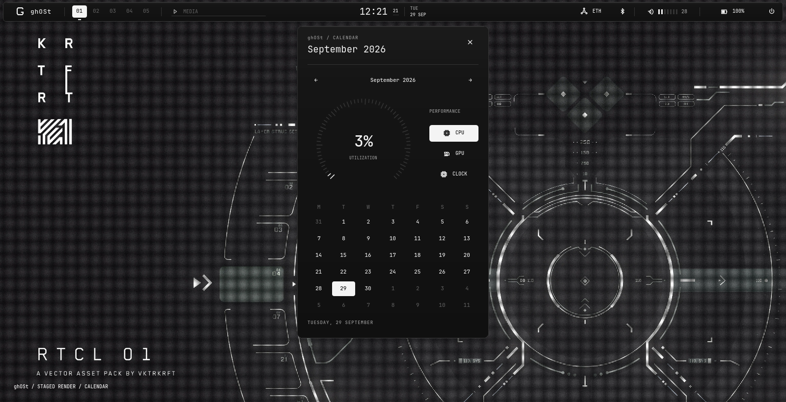

# ghOSt

Graphical Hyprland Operating System Toolkit.

A monochrome Quickshell desktop for Arch Linux and Hyprland.

[Preview](https://dsksnkz.github.io/ghOSt/) · [Changes](docs/changes/2026-09-29-telemetry-repair.md)



## Current scope

Top rail, calendar, radial performance instrument, audio, network, Bluetooth, media, battery and session panels. JetBrains Mono typography, Turret Road G, custom black/white icons and click-triggered motion.

CPU is measured from Linux counter deltas. GPU utilization is read only when selected. Processor means average clock frequency in MHz, scaled to the hardware maximum when available. Missing or stale readings show unavailable. Sampling stops when the calendar closes.

## Stage

Requires Arch Linux, Hyprland, Quickshell 0.3.1 with Networking/Bluetooth, Python 3 and JetBrains Mono Nerd Font. Turret Road is bundled under the OFL. NVIDIA utilization optionally uses nvidia-smi; supported DRM devices use gpu_busy_percent when available.

```sh
git clone https://github.com/dsksnkz/ghOSt.git
cd ghOSt
./install.sh
```

Default installation stages a separate copy under ~/.local/share/ghost/staged/ghost-bar. It does not start the shell or change the active rice, wallpaper, keybindings or autostart. Existing staged copies are backed up.

## Activate deliberately

```sh
./install.sh --activate
```

This explicitly installs into ~/.config/quickshell/ghost-bar, adds autostart and a layer animation rule, and disables Serpantinum's bar if present. Existing launcher, lock and Wi-Fi authentication still depend on Serpantinum; this is not a complete independent rice yet. Settings helpers are pavucontrol, nm-connection-editor and blueman-manager.

The legacy restore command is ./install.sh --restore. It verifies tracked integration files before restoring the original snapshot; later edits require manual reconciliation. Backups are under ~/.local/state/ghost/backups. Staging alone needs no live rollback.

## Controls

- Workspace numbers switch workspace; scroll navigates.
- Clock opens Calendar; CPU / GPU / CLOCK switch the radial readout.
- Audio opens volume; scroll adjusts; right-click mutes.
- Network, Bluetooth, battery and media open their panels.
- Escape or click outside closes a native panel.
- Buttons support Tab focus and Return/Space activation.

## Verification

The 0.2.1 revision is staged, not activated on the laptop. It was rendered with the actual QML components in an isolated offscreen Quickshell instance. Native focus, multi-monitor placement and click-origin motion still need an opt-in live pass.

```sh
python3 -m unittest discover -s tests -v
```

See [verification](docs/verification.md) for evidence and limitations. Public previews use component-only renders. Private references remain excluded.
