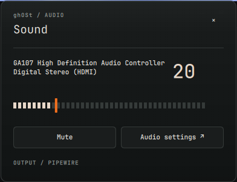

# ghOSt

Graphical Hyprland Operating System Toolkit.

A Quickshell desktop for Arch Linux and Hyprland. Graphite surfaces, JetBrains Mono, quiet orange accents.


## Top bar

Workspaces, media, calendar, system tray, networking, Bluetooth, PipeWire volume and battery. Native service connections; 120–230 ms interaction animations. No polling subprocesses or continuous decorative animations.

## Install

Requires Hyprland 0.56 with Lua dispatch, Quickshell 0.3.1 (including Networking and Bluetooth), Python 3 and JetBrains Mono Nerd Font. Optional settings applications: `pavucontrol`, `nm-connection-editor`, `blueman-manager`.

This first release integrates with an existing Serpantinum session for launcher, lock and new Wi-Fi authentication. It is not yet a standalone replacement for those services.

```sh
git clone https://github.com/dsksnkz/ghOSt.git
cd ghOSt
./install.sh
```

The installer backs up the files it touches, installs to `~/.config/quickshell/ghost-bar`, and adds a login entry and a rule allowing ghOSt to control its own animation timing. It preserves keybindings, monitor settings, wallpaper, and other compositor settings. When Serpantinum is installed, only its bar is disabled; its launcher, lock, notifications, authentication and shortcut services remain in use during this first stage.

Restore the previous bar with `./install.sh --restore`. Backups are kept in `~/.local/state/ghost/backups/`.

## Controls

- Workspace numbers: switch workspace; scroll to navigate.
- Clock: calendar, with month navigation.
- Audio: volume panel; scroll to adjust; right-click to mute.
- Network / Bluetooth / battery: corresponding panel.
- Tray icons: left-click activation; right-click native menu.
- ghOSt / power: launcher, settings, lock.
- Escape or click outside: close panel.

Theme and timings: `config/quickshell/ghost-bar/Theme.qml`.



Visual direction: [design notes](docs/design.md).
