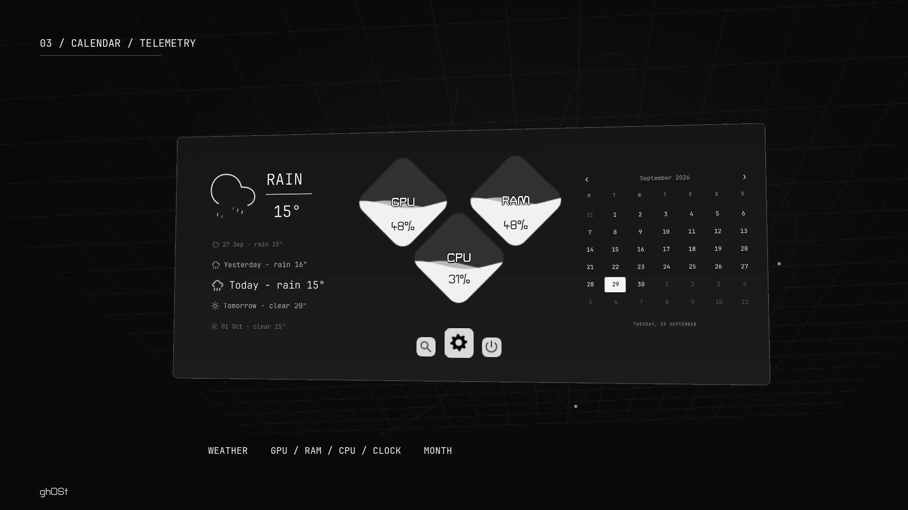

# ghOSt

Graphical Hyprland Operating System Toolkit.

A monochrome desktop shell for Arch Linux and Hyprland, built with Quickshell.

DISCLAIMER: Designs are created in Figma, code was written with AI.



[Website](https://dsksnkz.github.io/ghOSt/) · [Source guide](docs/source.md) · [Progress](docs/PROGRESS.md)

## Components

- **Top rail:** workspaces and device controls. Scroll switches desktops; clicks open panels.
- **Calendar:** dates, London weather and device usage. Real system readings drive liquid meters.
- **Sidebar:** network, Bluetooth, audio, brightness and notifications. Uses standard Linux services.
- **Settings:** device and desktop preferences, grouped by function.
- **App launcher:** searches installed desktop entries; saves pinned favourites locally.
- **Motion:** grouped sidebar entrance and randomized calendar reveal, with reduced-motion support.

The website shows real components rendered with sample data
(`scripts/capture_site.py`). [Google Material SVG icons](docs/icons.md) are bundled with their licence.


## Install

Requires Arch Linux, Hyprland, Quickshell with networking/Bluetooth/PipeWire,
Python 3 with GObject/Gio, and the Adwaita Sans font (`adwaita-fonts`).

[Hyprland integration](docs/hyprland.md) contains the current ghOSt window/motion
rules, portable autostart and optional shortcut replacements. Replace matching
bindings deliberately; the installer does not add shortcut modules.

The lock screen shows a large clock over your wallpaper, and any key brings up
your picture and the password field. It uses Quickshell Wayland session lock and the
existing `/etc/pam.d/hyprlock` service. Optional bindings are in
[ghost-lock.lua](config/hypr/ghost-lock.lua); the installer does not lock your session.

```sh
git clone https://github.com/dsksnkz/ghOSt.git
cd ghOSt
./install.sh
```

Default installation stages the complete runtime without changing your desktop.
`./install.sh --activate` deliberately installs and starts ghOSt and adds its own
autostart. It does not disable another bar or replace shortcuts; switch existing
bars deliberately to avoid overlap.

The shell restarts by itself if it exits unexpectedly, and its bar returns when a
disconnected display does. Each unplanned exit is logged in
`~/.local/state/ghost/shell-restarts.log`.

| Command | Action |
| --- | --- |
| `ghost shell` | Restart the shell |
| `ghost start` | Start the shell and keep it running |
| `ghost stop` | Stop the shell |
| `ghost lock` | Lock the session; the lock screen returns if it crashes |

`install.sh --activate` also works on a stock Hyprland config. It adds Super+Space,
Super+I, Super+L and Super+Tab there, and keeps your shortcuts when ghOSt ones exist.
Network, Bluetooth and power profile controls need their system services enabled,
which the installer leaves to you.

`./install.sh --restore` restores verified integration snapshots. Later edits
may require reconciliation. Backups live in `~/.local/state/ghost/backups`.

