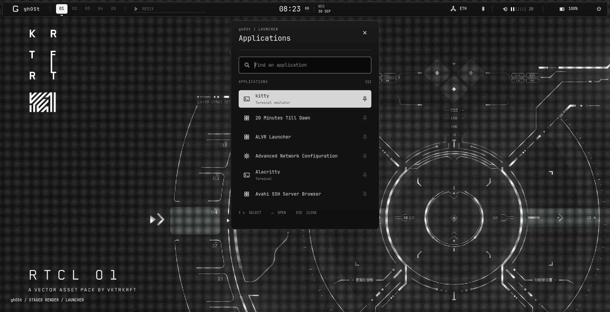
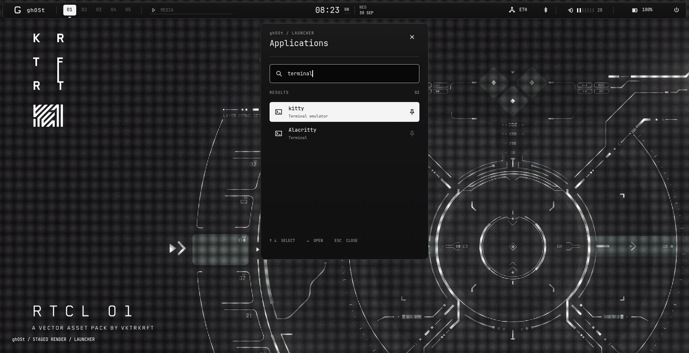
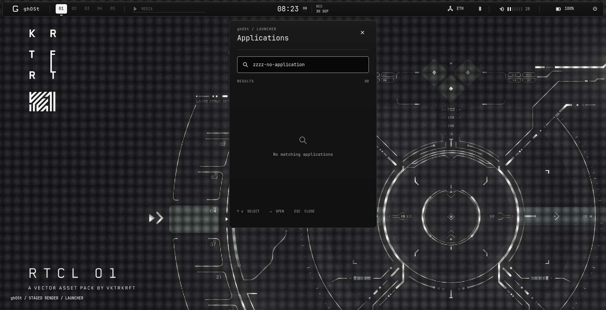
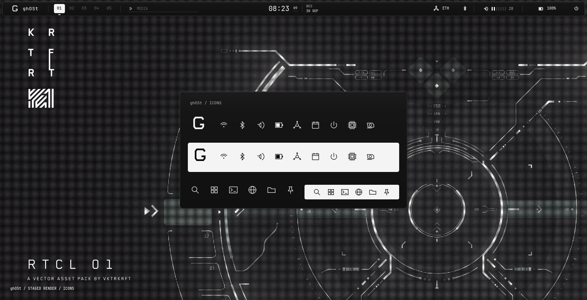
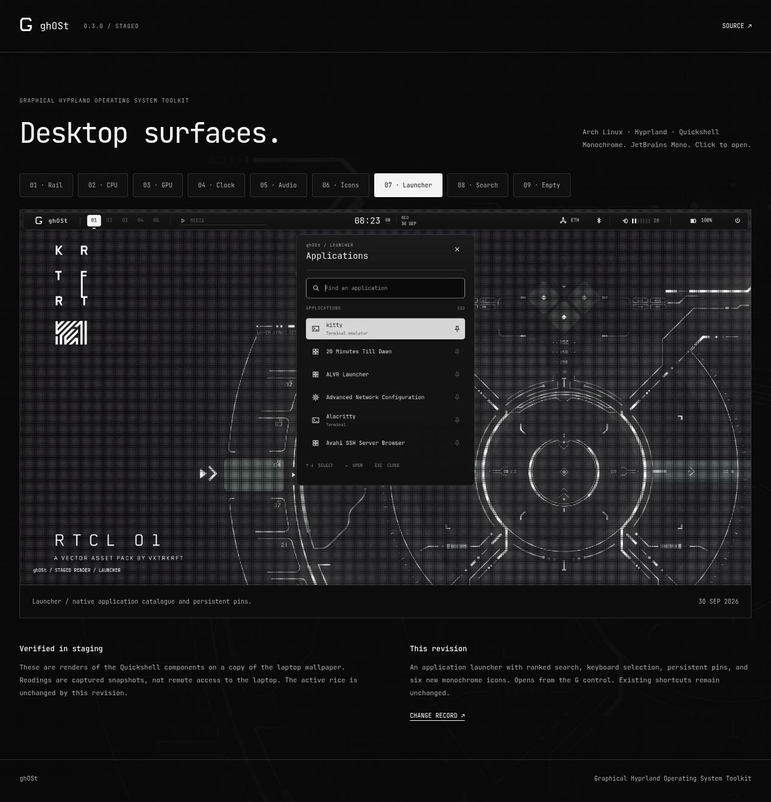
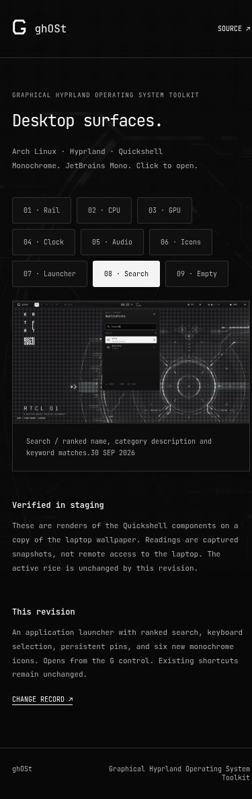

# 2026-09-30 / Launcher / 0.3.0

Staged only. The active rice, wallpaper, keybindings and autostart were not changed.

## Changes

1. Independent launcher from the G control and session panel. Uses Quickshell's native desktop-entry catalogue and execution API.
2. Ranked search across name, generic name and keywords. Hidden entries are filtered; all search words must match. Exact/prefix names rank ahead of metadata.
3. Keyboard selection with bounds, Enter handling, focus handoff, six visible rows and a 90ms highlight slide. Existing global shortcuts remain unchanged.
4. Persistent pins with malformed-data recovery. Pins sort first within equal search scores. Storage: `~/.local/state/ghost/launcher.ini`, respecting `XDG_STATE_HOME`.
5. Six custom 2D icons: search, applications, terminal, browser, folder and pin. All render in black or white.
6. Responsive preview gallery updated with real component renders of launcher, search, empty state and icons.

Files: `Launcher.qml`, `LauncherSearch.js`, `Icon.qml`, `Desk.qml`, `Rail.qml`, `Panel.qml`, `PanelContent.qml`, `preview.qml`, `qmldir`, `tests/test_launcher.cjs`, site and documentation.

## Checks

- `node tests/test_launcher.cjs`: 15 assertions passed.
- `python3 -m unittest discover -s tests`: six telemetry tests passed.
- Actual QML loaded offscreen with 112 installed applications. IPC exercised queries, first/last bounds, empty results, pin persistence across process restart and launch selection without starting an app.
- No remaining QML errors. Expected isolation/window-mask warnings; two malformed-line warnings originate in existing desktop entries.
- Staging installer succeeded in `.local/verification/launcher-install`.
- Both native shell processes retained their original PIDs. Live Hyprland keybind JSON remained byte-identical; `hyprctl configerrors` was empty.
- Browser gallery launcher/search states passed; 390px viewport had no horizontal overflow. Screenshots inspected at desktop/mobile sizes.
- Preview wallpaper still matches the separately exported current wallpaper, SHA256 `fe702fbafaa4d08365231955264781942e806920d4f9e59b412c689890cbd38d`.

Limits: native keyboard events, actual app startup, focus grabs, multi-monitor placement and click-origin animation need an explicitly authorized live pass. Offscreen screenshots do not prove those interactions. No performance benchmark claim is made. The installed older ghost-bar remains unchanged.

## Screenshots

[Live preview](https://dsksnkz.github.io/ghOSt/)

## Recovery

Pre-change source/site/docs snapshot: `.local/backups/20260930-launcher/`. Prior commit: `518c938`. No live rollback is needed because this run did not activate the rice. Preview pin state is isolated under `.local/verification/20260930-state/` and excluded from Git.
