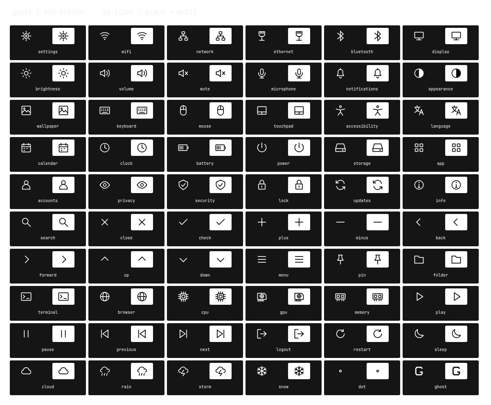

# 2026-10-02 / SVG icon system 01

60 transparent, standalone 24px SVGs, each in pure black and pure white. Common Settings categories, connectivity, hardware, weather, media, navigation and session actions share a 1.5px outline system. The G is extracted from the bundled Turret Road font under its retained OFL.

## Changes

- Reusable assets in config/quickshell/ghost-bar/icons and site/assets/icons; no icon-theme dependency.
- SvgIcon.qml exposes name and black/white selection, with device-scale raster sizing.
- An isolated QML catalogue displays every icon in both tones.
- A responsive gallery provides search, light/dark preview and individual downloads.
- Deterministic generation and XML/pixel tests keep shell and website copies synchronized.

[Live gallery](https://dsksnkz.github.io/ghOSt/icons.html) · [Usage](../icons.md)

## Output

[Dark browser screenshot](../../site/assets/svg-icons-web-dark.png) · [Light browser screenshot](../../site/assets/svg-icons-web-light.png) · [Mobile screenshot](../../site/assets/svg-icons-web-mobile.png)

## Verification

Nine Python tests and 15 launcher assertions pass. All 240 raster renders (60 icons × two tones × two sizes) have transparent margins, pure monochrome pixels and matching alpha masks. XML excludes scripts, embedded raster images and external resources. Generator --check passes. All 120 icon images report Ready in isolated offscreen Quickshell. The QML collection and browser modes were visually inspected. Search hardware returns three icons; an unmatched search shows an explicit empty state. All 60 browser images load. The 390px layout has no horizontal overflow. Staging installation includes the SVG assets without modifying the active configuration.

The current wallpaper export remains byte-identical to the inspected laptop wallpaper. Before/after live bind JSON matches and Hyprland reports no configuration errors. Native rice processes were retained. No power/session actions were executed. Private reference images and desktop content were not published.

Base revision: 0075bdc. Recovery snapshot: .local/backups/20261002-icons/. No activation occurred; these additions can be reverted independently. Existing Canvas controls remain in place. Native Wayland interaction, future SVG integration and performance under a real interactive workload are not claimed verified by this asset test.

## Pending brief

prompts.md blob f1c5f9ed4c10315c5f99f4ee83fcf28e9a8abb8d and mainDesigns image blob 9cc34c7e555a0cbfbff777d194a13ac3b799e6fe were inspected. The calendar composition and motion remain pending, as do rail tooltip removal, the terminal reference match, compact power HUD and old-rice dependency removal. The current shell/installer still has legacy coupling; independence is not claimed. This icon delivery completes only the separate SVG request, not the calendar prompt revision.

Usage: start 0% five-hour / 16% weekly; publication preparation 52% / 24%. No reset credit redeemed. Further surfaces are deferred to keep this run bounded.
