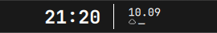

# Remove rail calendar icon

Removed only the calendar glyph before the top rail clock. Time/date/weather,
the full calendar click target and existing geometry remain. Removed the old
calendarIconCenter diagnostic and its obsolete spacing assertion.

Production surfaces compile; diff checks pass. Live reload reports Configuration
Loaded and installed Rail.qml matches source. No calendar data or behavior
changes were made.

Snapshot: `.local/backups/2026-10-09-rail-calendar-icon-3c2gzp/`.
