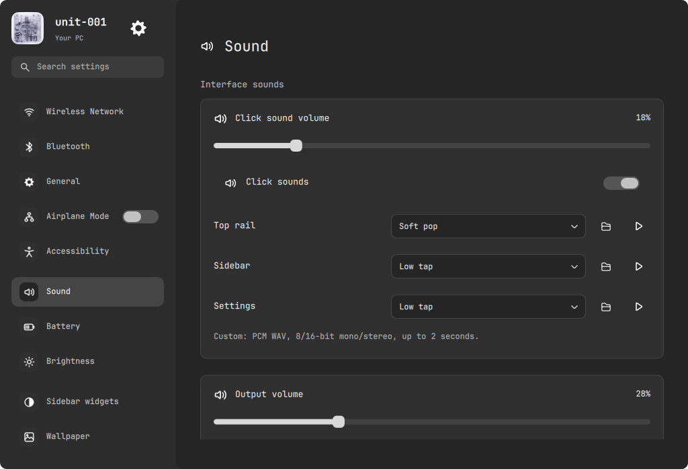

# Interface sound controls

Settings > Sound now opens with click-sound volume, mute and separate top-rail,
sidebar and Settings sound selectors. Each has a WAV chooser and play button.
Existing media volume, devices, microphone and equalizer remain below.

## Behavior and files

- UiSounds.qml uses local Settings preferences for 0-100% gain, enabled state
  and one preset per surface. Soft pop, Low tap and Light tick are the existing
  three original PCM assets; Off silences one surface. Defaults retain the prior
  distinct sounds and18% gain. No random selection or new audio dependency.
  Each group keeps one SoundEffect. Global throttle/Ready checks remain; previews
  dispatch only the selected sound, not a second Settings click. Missing custom
  sources show an error and disable playback. Fixtures are silent and muted.
- SettingsPanel.qml adds Interface sounds at the top of Sound, with independent
  gain, enable toggle, three owned-icon selectors, folder chooser and play keys.
  Volume writes are debounced180ms and retry while another change is running,
  preserving the latest drag. Choice labels stay bound to accepted state, also
  when a chooser is cancelled. Relevant errors appear beside the sound controls.
  It uses the existing dark material, G2 corners, hierarchy and scroll layout.
- settings_backend.py stores typed `sounds` preferences in the existing private
  ghost/settings.json. Writes preserve other settings and never call audio/system
  setters. Custom import accepts local uncompressed8/16-bit mono/stereo PCM WAV,
  8-96kHz, nonempty and at most2 seconds/2MB. Unsupported/truncated input fails
  without changing preferences. Originals are untouched; immutable hash-named
  copies live privately in ghost/ui-sounds/, mode0600, with content deduplication.
  Stored sources must belong to that private folder, never a remote URL.
- Seven additional backend tests cover defaults, persistence, independent
  choices/gain, corrupt preferences, invalid bounds, custom copying, deduplication,
  malformed/oversize-duration WAV and remote/unowned source rejection.
- input-test.qml/scripts/verify_input.py cover actual slider and preset-key
  events, per-surface Off, chooser dispatch, master mute, playback availability,
  production source/gain changes and silent fixture guards. Test window width
  matches the1024px Settings surface so right-side controls receive real events.

## Verification and desktop

71 Python tests pass, including isolated distribution and mocked system actions.
Actual software-rendered offscreen Qt input checks, production compilation,
10 router transitions,14-page polling/real5s timer/fixture safety and12 scan
transitions pass. Icon generator and existing launcher/workspace/corners/wave/
network/website JS suites pass. No new website was built.

Only UiSounds.qml, SettingsPanel.qml and settings_backend.py were hot-reloaded
into the active ghOSt profile. Installed files match source; ghOSt PID222465 and
legacy PID1824 remain. Native effects report Ready and18% gain; a preset change
selected by the user was reflected by the native UI/runtime. No media-volume,
brightness, connection, wallpaper, shortcut, autostart,
gameplay or hardware change was performed. No custom file or sound was chosen
unattended, and test playback is always suppressed.

Background tests did not open a window over gameplay. After the user's explicit
request to see the controls directly, the real Settings window was opened on
Sound and left available for inspection. Native output was inspected:

This is active native output, not a preview or fixture. Only the Settings content
is exported; private media, network lists, custom filenames/audio and foreign
applications are excluded. The original three sound assets remain unchanged.

Current GitHub main prompts.md and mainDesigns were read and local blobs match:
`f1c5f9ed4c10315c5f99f4ee83fcf28e9a8abb8d`,
`9cc34c7e555a0cbfbff777d194a13ac3b799e6fe`,
`8b137891791fe96927ad78e64b0aad7bded08bdc`. Prompt text is unchanged.

## Recovery and remaining limits

Exact affected source/live/test/doc copies, including the original private
preferences, are under `.local/backups/2026-10-09-sfx-settings-oupEwt/`.
Do not restore that private preference copy over subsequent user choices.
Three unrelated untracked files are untouched.

Real gain/source bindings and native UI were checked; subjective loudness and
live custom-file selection were not exercised unattended. PCM validation/copy
and persistence are verified against private temporary files. Broader prompts.md
work remains unfinished. Published `9490dea`; remote revision and seven
runtime/test/native-image blob hashes match. A fresh committed archive passes
all71 Python tests, actual silent Qt input, production compile and generator checks.
