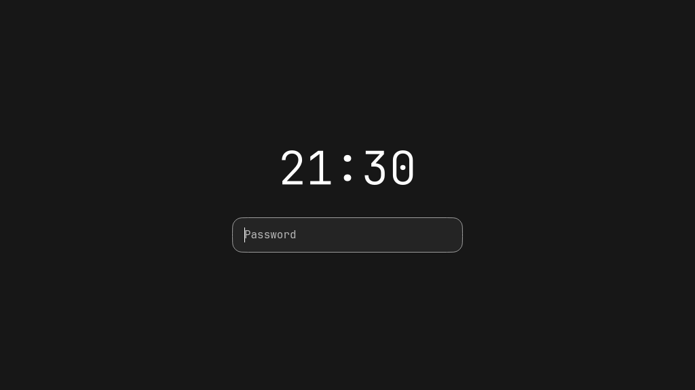

# Venetian blinds lock

The user's requested sequence is implemented in an independent lock entry:

- `lock/Blinds.qml`: shaded horizontal slats, 54px target height, full-screen
  descent and stationary rotation around each slat's horizontal axis.
- `lock/LockScene.qml`: 800ms Bézier descent, 420ms blur/opacity transition on
  first typing or click, HH:mm digital clock and masked password field. The
  first typed character is retained. Enter submits and clears the field.
- `lock/LockAuth.qml`: PAM conversation state, bounded one-pending-response
  flow, repeated-submit suppression and recoverable failure UI. Only
  `PamResult.Success` authorizes exit. Secrets have no logs, disk storage,
  command-line arguments or IPC endpoints; cleared references are not a claim
  of cryptographic memory erasure.
- `lock.qml`: one secure `WlSessionLockSurface` per output, existing
  `/etc/pam.d/hyprlock` authentication, no unlock IPC or fixture bypass.
- `lock/ExitOverlay.qml`: after successful authentication, maps transparent
  overlays with closed blinds, then releases the session lock and rotates the
  slats over the actual desktop for 680ms. Empty input regions allow interaction
  after authentication. Slats never travel upward during exit.

Reduced motion makes transitions immediate. The shell reads that existing
private preference. Screen changes update the overlay readiness/completion
barriers. These paths compile but the real secure/multi-monitor handoff is not
yet exercised. The exit overlay depends on compositor surface configuration;
the preparation delay is 50ms and does not claim a proven visible frame barrier.

Qt offscreen tests exercise descending/intermediate/final geometry, first-key
delivery, visible password field, masked submit/clear, start failure, failed/error/
max-tries outcomes, success gating, repeated submissions, stationary rotation and
reduced motion. Production entry compiles using the native Wayland backend without
instantiation. Existing Qt input suite and Lua syntax pass. Installed lock files
and PanelContent match source; Hyprland config errors are empty.

No real lock, PAM attempt, reboot, logout or suspend was executed. Existing
authentication files and legacy shell remain unchanged. Actual password unlock,
compositor secure state, overlay handoff and hotplug require normal user testing;
do not present these screenshots or mocked outcomes as a live authentication test.

These are actual Qt renders of the production visual components on a software
offscreen test surface, with fixed time and empty input. They contain no private
desktop or credential data; software capture does not demonstrate hardware blur.
The rotation render has a transparent test background, not the user's desktop.

The public installer automatically includes the lock subdirectory with the shell.
Optional keybinds are provided in `config/hypr/ghost-lock.lua`. Local Super+L and
power-key Lock now target the entry directly; wlogout's Lock action and ghOSt's
existing confirmed Lock menu target it as well. Other shortcut combinations and
wlogout session actions were preserved.

Recovery snapshot: `.local/backups/2026-10-09-venetian-lock-RydxHg/` includes
original live keybinds/autostart/wlogout layout/PanelContent and affected project
documents. The newly added live lock directory can be kept while restoring those
exact original routes. Serpantinum removal remains a separate unfinished task.

## Standalone launch repair

The user's first real launch exposed `G2Surface is not a type`: nested
`lock/shell.qml` made the shared surface an import outside Quickshell's config
root. The earlier compile harness used the bar root, so it missed this boundary.
The entry now lives at `ghost-bar/lock.qml`, imports the visual components from
`lock/`, and sets an explicit `ghost-lock` ShellId. All launch routes match this
entry. Visuals are unchanged, so the existing test-rendered frames still apply.
Correct-root production compile and mocked input/auth tests pass; real session
locking is still not automatically tested. The old installed nested entry was
moved to local trash after its replacement and original snapshot were saved.
