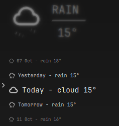
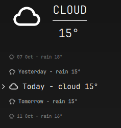

# Weather switch transition

CalendarPanel now keeps the displayed headline separate from the immediately
selected forecast. Wheel input, forecast row clicks and changed headline data
coalesce within the event loop and restart a 300ms transition: 110ms to full blur,
update icon/condition/temperature together, 190ms to sharp. The complete headline
uses Qt Quick MultiEffect blur (maximum 24px) with a gentle opacity reduction.
The compositor/input target and forecast list stay responsive throughout.

Rapid selection reads the latest forecast at the midpoint. Reduced-motion and
inactive panels stop the animation and immediately synchronize content. The
offscreen Qt test checks the pre-switch display, blur midpoint, latest selection,
final zero blur and reduced-motion behavior, plus the existing actual wheel test.
The forecast column and row glyph containers start at x0 within the same weather
section as the headline. The hollow arrow moves to x−16 outside the row clip;
row hover targets still cover the full 194px row. Existing 100/70/60% sizes remain.

Production surfaces compile; actual Qt input suite and diff checks pass. The
installed CalendarPanel matches source. Native hot reload reports Configuration
Loaded without new effect errors. Native diagnostics measured blur 0.726 while
moving; the captures below show actual old blurred and new sharp headline states.

Only the weather element is published. Early captures taken after the panel
closed were rejected and moved to local trash, never staged or published.
Snapshot: `.local/backups/2026-10-09-weather-transition-UqsUr6/`. No real weather values are
fabricated; underlying London data and rail summary behavior remain unchanged.
